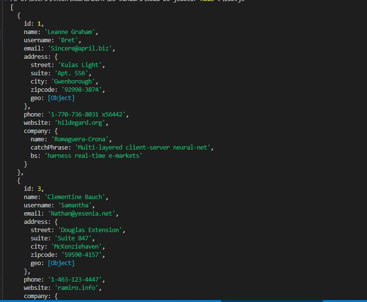

# User Search Project

## Description
This project allows users to search for data based on a manually entered keyword. It fetches data and filters the results by the user's input, displaying the search results in the console.

## Features
- Manual keyword input for searching
- Data filtering based on user name
- Console output of search results

## How to Use
1. Run the application with node
2. Enter a keyword to search for
3. The program filters the fetched data by the keyword
4. Results are displayed in the console

## Technologies
- JavaScript
- Node.js

## Screenshot
- Search results are displayed in the console like pictures below
- Used keyword = "Le"

.JPG)